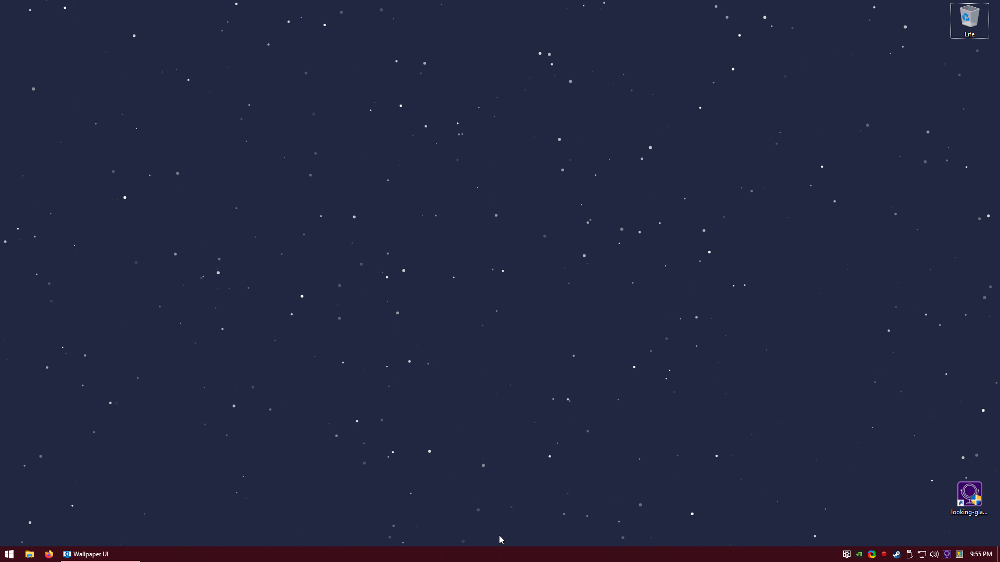

# WE-CustomParticles

A web wallpaper for wallpaper engine that allows you to use Particles.js and an image together.

## Download
[Download the latest official build from steam.](https://steamcommunity.com/sharedfiles/filedetails/?id=1422309649)  
If you want to use the latest source, `git clone` the project and manually import it (see section Testing).

## Development
Development is quite simple, all you need to do is start a web server and visit the url that represents the `index.html` file.
I used VSCode to develop this extension, so I installed [Live Server](https://marketplace.visualstudio.com/items?itemName=ritwickdey.LiveServer) and ran it through there. This gives you automatic reloads when changes happen.

## Testing
To test the project and any changes you made, open Wallpaper Editor and import the `index.html` file.

## Production build
To keep the build size small, the following files and folders will be removed on build:  
- `.git/`  
- `.media/`  
- `.vscode/`  
- `.prettierrc`  
- `README.md`  

## Options (aka Properties)
| Name | Description | Default Value |
|-|-|-|
| Particles.JS JSON Configuration | This is the JSON string Particles.js uses. If this string starts with  `http`  or  `file` , a fetch request shall be made and the returned body will be used as JSON content. | (A very long JSON string, see project.json) |
| Background Size | The background image size. [MDN Docs](https://developer.mozilla.org/en-US/docs/Web/CSS/background-size) | 100% |
| Background Position | The background image position. [MDN Docs](https://developer.mozilla.org/en-US/docs/Web/CSS/background-position) |  |
| Background Repeat | Indicates if the background should be repeated or not, and if so; in what way. [MDN Docs](https://developer.mozilla.org/en-US/docs/Web/CSS/background-repeat) | no-repeat |
| Use Background Image File | Replaces the default background image url input with a file selector. **Note!** This does not actually change what value gets read by this wallpaper, so make sure the field below is empty before checking or un-checking this box. | false _(unchecked)_ |
| Background Image URL | The background image url. |  |
| Background Image File | Basically the same as image url, but with a file selector. After the file selector is used `file:///` shall be prefixed so the css `background-image` property can read it correctly. **Note**, this field is only shown if `Use Background Image File` is checked. |  |
